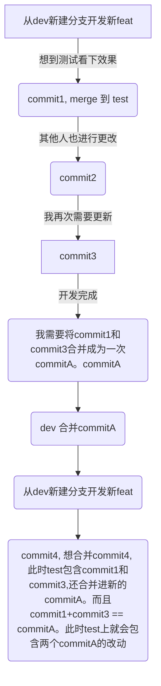

## **今天完成了什么？值得肯定的地方是什么？**（目的：建立信心，看到进步，而不是只盯着没做完的事）
- 今天还把`git冲突`的具体过程给画出来了，`mermaid`用来画流程图还是很不错的
- 今天还把多应用数据统计的`bug`全部排查完毕,有以下这些bug
  - 1. 实际广告收入是手动输入的，且主页上当天的实际毛利收入为0时，当日的毛利也为0。 为了和主页数据相同，返回本月的毛利中需要查询出天数，不能直接计算总和。
    修复毛利润的单位计算错误。
    用户活跃判断条件修改为用户当天是否有启动事件

## **今天有什么事情可以做得更好？卡点在哪里？**（目的：发现问题，但不是自责。例如：“沟通时没先确认对方需求，导致返工”）
## **基于以上，我明天可以立即尝试的一个小改进是什么？**（目的：将复盘转化为行动。例如：“明天开会前，先花2分钟写下核心目标和问题”）